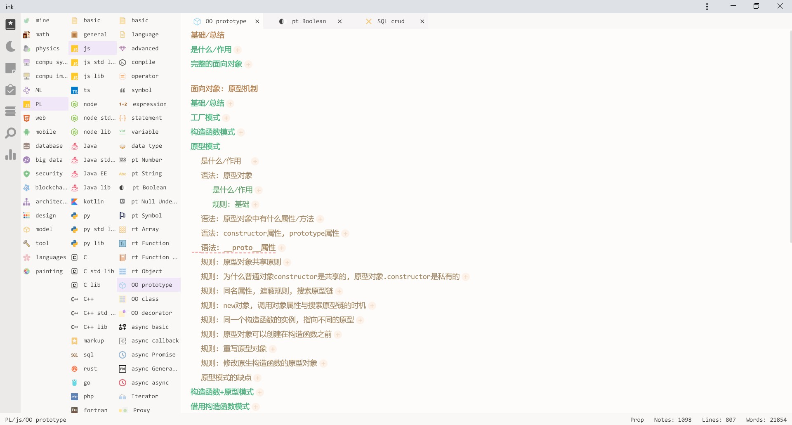
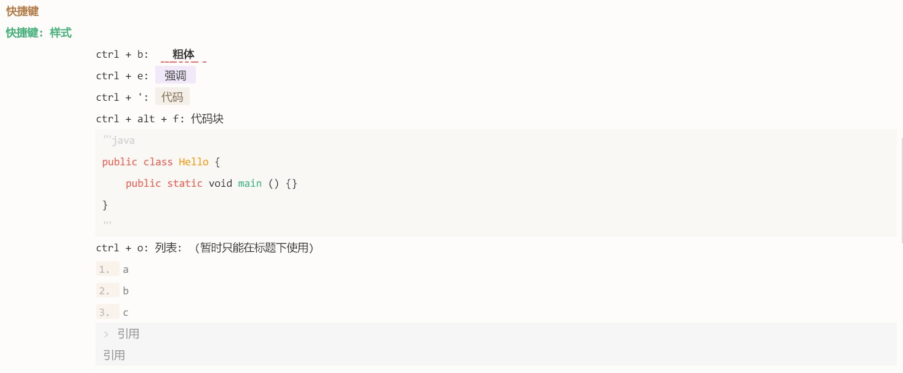
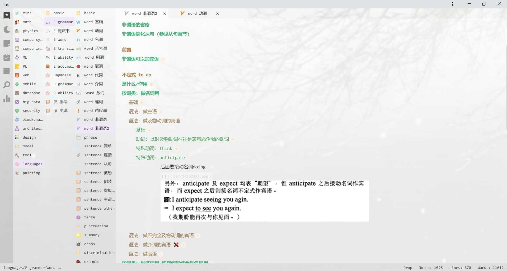
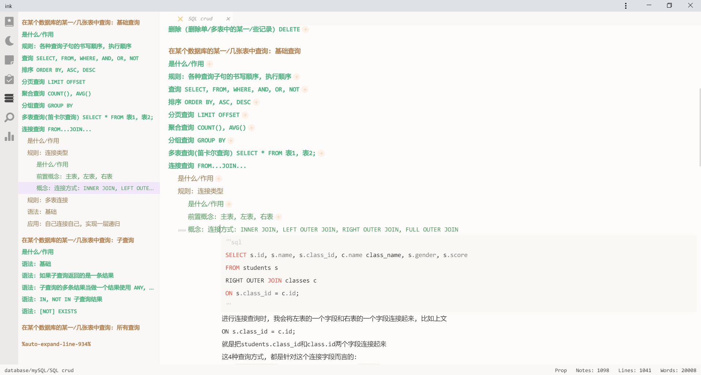
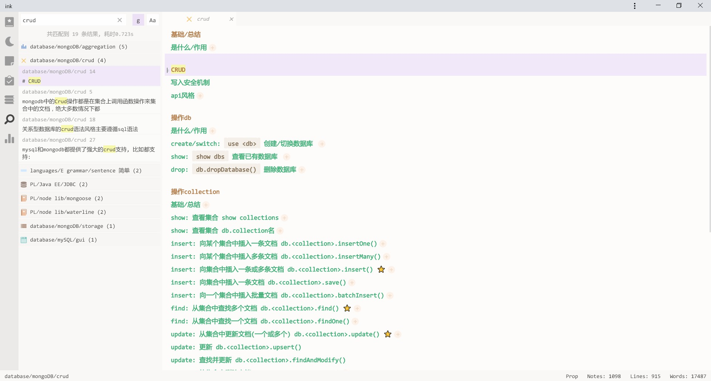
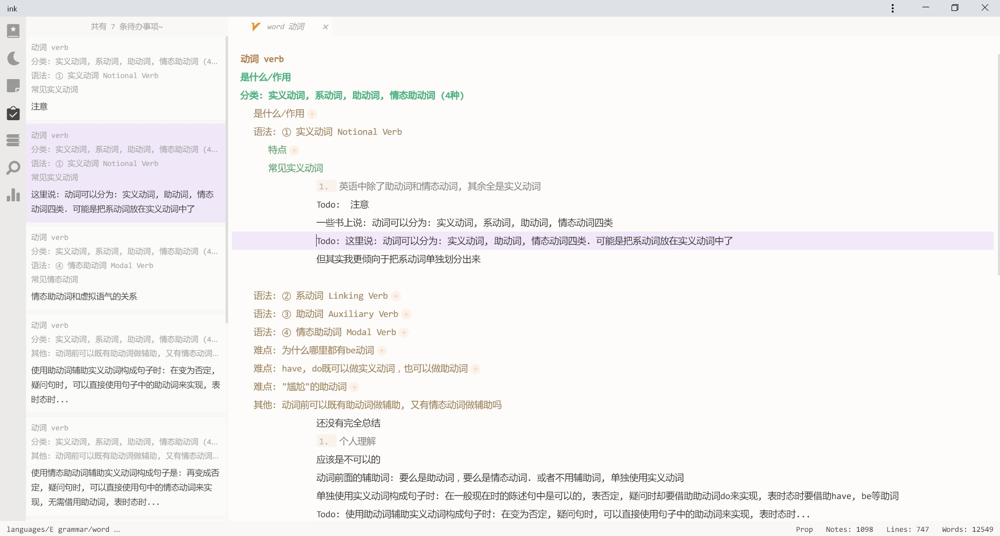
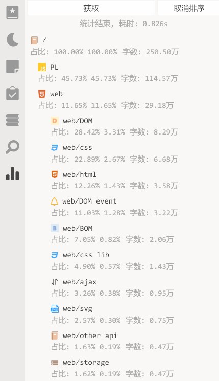

# 在线预览
http://49.235.122.88:9999/
如果您不想在本地部署, 可以通过这个网址进行在线预览.
* 未给移动端做适配, 请使用电脑访问
* 服务器带宽较小, 打开网页可能较慢, 望耐心等待
* 所有人均可访问该网址, 笔记本中的笔记对所有人可读可写. 不支持多人协调编辑, 多人编辑一个文件时, 会出现覆盖现象, 该网站只用作演示

# 重要说明
* 这是一个利用闲余时间制作的个人笔记本工具, 当前还处于alpha阶段, 且不保证继续维护
* 如果发布正式版的话, 项目架构还会有很大的变动
* 项目中存在大量bug和待优化项, 且尚未编写测试用例和开发者文档
* 不过事实上该应用已经基础可用了, 我自己已经使用该工具将近两年时间, 记录了逾百万字笔记了. 如果您喜欢尝鲜, 或者真的需要这种形式的工具, 可以选择尝试一下, 但要做好面对各种bug的心理准备.


# 是什么: 一个所见即所得的markdown编辑器
A WYSIWYG Markdown Editor

这是一个完全在本地运行的, 轻量级的, B/S架构的markdown编辑器, 基于codemirror进行开发.


效果图:

基础效果:



支持的markdown语法:



自定义全局背景:




大纲视图:



全局搜索:



待办事项:




统计分析:



快速跳转笔记:


该工具的特点:
* 所见即所得的markdown编辑器
* 文件自动保存
* 轻量级, 本地运行
* 支持全局搜索, 大纲, 便签, 多标签页, 统计等工具
* 支持笔记图标, 全局背景图片
* 使用纯粹的markdown文件, 您可以随时迁移到别的markdown笔记本工具中去


# 重大问题与缺陷
* 暂不支持表格
* 对数学公式支持很差, 仅勉强可用$x^2 + y^2 = 1$
* 有时无法插入图片文件, 请改用截图插入
* 不支持多级列表
* 主题系统暂不可用(当前仅包含一套主题)
* 需要迁移到https


# 如何使用 ⚠️
该项目是一个基于codemirror的markdown编辑器, 是B/S架构, 包含客户端和服务器端两个部分, 运行时两个部分都要启动
1. 请确保您的电脑上安装有`node 12.13.0`或更高版本
1. `git clone`当前项目
2. 接下来启动服务器:
    * 跳转到`server`目录
    * 运行`npm install`安装依赖
    * 运行`node app`运行服务器, 服务器默认监听`12340`端口
3. 接下来启动客户端:
    * 跳转到`client`目录
    * 运行`npm install`安装依赖
    * 运行`npm run build`编译项目
    * 启动任意一个本地服务器, 比如`http-server`, 托管编译好的`client/dist/`目录
    * 在浏览器中打开对应网址即可
4. 成功的话, 您将看到这个页面
5. 现在可以在其中书写笔记了, 在左侧边栏(目录栏)右键, 可以创建目录, 删除目录. 拖动可对目录进行排序
6. 其他
    * 请使用`坚果云`之类的备份软件, 托管`server/user/`目录, 您所有的笔记. 图片都保存在该目录下⚠️
    * 安装好之后, 打开笔记本, 可以看到一个`用户手册`文档, 推荐在开始使用前详细阅读一遍

# 下阶段开发计划
* 支持表格, 数学公式
* 添加单元测试
* 用ts重写服务器端
* 重写模块化系统和插件系统
* 添加的导入, 导出, 笔记分享功能
* 打包出来一个可直接安装使用的client


# 已知Bugs, 或待优化项
* sticky note拖动有拖影, 还会抖一下, 因为drag世界的clientX, Y有问题. 需要修复. 还有注意它和目录拖动直接的影响
* 重新整理主题系统, 现在的太重了
* ink: fold 无法折叠图片, 图片后面需要有一个空行
* ink: imgs 有些图片无法上传
* server: 一级目录不支持中文, 需要修复一下
* ink: 重命名还是不区分大小写
* 打开一个文件. 切换目录然后再切换到当前文件, 竟然会触发保存
* 添加各个页面端元数据. 如是否折叠
* 删除文件会露出背景图
* 系统文件_开头改为.开头, 因为用户可以定义_开头的文件
* 关闭md对<div>之类的自动高亮
* 运行用户自动设置要使用哪些代码高亮(比如lua), 和代码theme
* 字数统计统计的是字符, 需要单词. 且现在三秒统计一次
* 修改图标大小至100%
* 插入图片不应消掉当前行
* 重复打开一个文件, 会利用浏览器缓存吗? 那会不会出错
* 纯数字命名的笔记有丢失的可能性
* 图书icon星星是白色的
* '''markdown '''中间的标题无法被正确折叠, 其他的#倒是可以被正确折叠, 这说明, 查看每行是否以# 开头, 是无法确定是否是标题的
* img对互联网图片的支持
* 重命名可能会失败, 这可能和坚果云有关
* 文件名中包含四字节字符可能会报错失败 ⚠️ 但有些emoji, 如⭐好像不是特殊字符
* 没有用户配置文件, 或者用户配置文件中没有默认字段, 都会报错. 这完全可以通过复制默认配置实现. 而且配置文件硬性依赖plugins inkReplace等插件配置文件. 没有notes目录也会报错, 这个也可以自己创建
* 后端文件日志
* 移动端无法触发右键
* 删除备份文件时, 最后包含排除正式文件的逻辑, 防止正式文件被误删除
* 现在控制是否可以使用catalog的开关太多了, 应该由打开关闭文件统一控制. catalog - handleContentMenu中的开关当前就是无效的
* >引用中的**强调**会有样式bug
* 不准备对```markdown```做样式排版
* es关闭搜索框
* 数学字体也被替换为了元气满满
* 隐藏tag现在有一些bug
* 微软雅黑的粗体非常难看
* 以#开头的不一定都是标题, ctrl + shift + ]就无法正确识别, 创建目录也无法幸免
* 切换完一级目录, 二级目录变了, 三级目录没有变
* 在大多数Linux文件系统上，文件名最长可达255个字符。文件名可以包含除“/”和空字符（\0）外的所有字符。
* 在第一个一级标题按ctrl + j会失效
* 即便有退出前的监听, 强制退出时直接点击leave也不会保存笔记内容
* 粘贴图片还是会覆盖一行
* 把所有用户配置, 笔记, 图标放在user文件夹中, 方便迁移
* 好像讯飞英语输入的净化正则有点问题, 字母中间的 "大写" 好像不会被识别
* ctrl+shift+o, 重排序列表, 对于代码中的1. 2. 3. 之类的也会更改
* 对带鱼屏做优化, 运行自行设置边距
* 将图片文件夹拆分, 其中的文件太多了
* 编辑器中按删除键时, 图片的背景色会消失
* ink图标的右上角其实缺损了一块
* 打字快的时候, 逗号,会消失.
* 只读模式下折叠快捷键不起作用
* 非自动折叠的文件, 在打开时无法自动定位
* 颜色不应该写死在vue文件中, 包括darken()这种也应放在var里
* 把default.json迁出user, 让user中纯粹是用户自己的文件
* 通过快捷键新建一个标题时: 如果跨度过大, 这标题也不会滚动到屏幕中间来
* github的邮件报错
* todo组件应该能定义多个标志, 除了`todo:` 还应该有`todo：`
* 引用中的图片没有背景色
* 批量升降标题后, 会全部展开
* 移除对element的依赖
* 当文件大于30000字时, 应该提示用户进行拆分
* 标签页中键关闭
* ctrl + s会触发连续保存, 给服务器端代理压力, 可以添加节流
* 图标的大小问题
* 像search组件, 如果目录名变更的话, 不会同步更改. 好在现在必须离开search, 去catalog组件更改目录名
* prettier和eslint不一致
* 搜索和统计时没有加遮罩, 此时如果用户疯狂保存, 切换笔记, 可能会导致一些问题, 比如某个文件现在正在被后端的搜索程序所占用
* 大纲视图如果没有一级标题, 会显示没有标题. 而打开没有标题的页面, 旧大纲不会消失
* quick-open-bar, 对于只剩最后一个标题时删除该笔记, 然后再新建支持的不好
* 搜索栏的全部折叠与展开不好用
* 缩进时打字会消失
* 图片链接文件会失去样式
* 切换到不相关的笔记页面时，搜索栏可以不消失，只有用户手动关闭时才消失
* 点击展开按钮时, 应该把光标设置到当前行, 现在会保留在旧一行
* 二级标题下面直接是四级标题, 在大纲中无法正确显示
* 增加历史剪贴板, 防止文档丢失
* 搜索结果直接按标题排序似乎也不太合理, 应该添加一个排序按钮
* 搜索, 如果已经打开搜索页, 不会自动聚焦
* outline无法收集空标题
* 专注模式下无法打开ctrl+p
* 对于插入图片，如果选中了某些文字，则应该把这些文字给覆盖掉
* 删除desktop.ini
* 需要添加更多语言高亮的支持
* 需要内置默认字体
* 开启服务器时, 自动清理_deleted目录中的过期文件
* 前端rename, reorder, create等操作时, 正在编辑的文件的保存问题
* 疯狂ctrl+s就会疯狂触发. 来个节流吧
* 现在重命名文件时, 文件不能和自己重名
* 如何在程序启动时锁定对应的文件夹, 防止被外部程序占用呢
* 重命名文件夹之前, 应对锁定要进行操作的目录, 防止外界占用导致重命名失败, 现在的重命名操作, 是可能出现致命错误的, 虽然几率不大
* 定时清理图片
* z-index管理
* 主题统一的tag隐藏方案
* 每三天做整体备份
* 自己的ui组件库
* 日志系统
* 插入代码块应该智能判断是否另起一行
* 修改前端端口9002
* 搜索界面x错误(在ipad上面)