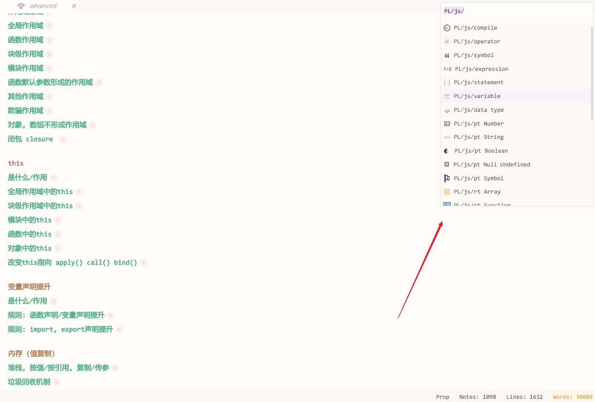

# 重要说明
1. 这是一个alpha阶段的项目, 且疏于维护
2. 正式版发布时, 项目架构会有很大的变动
3. 该项目中存在大量bug, 暂时没有测试, 作用开发文档
4. 不保证维护该项目
5. 但事实上该项目已经基础可用了, 我个人已经使用该工具将近两年时间, 并记录了200多万字的笔记了
6. 这是一个完全在本地运行的, 轻量级的, bs架构的markdown编辑器. 您所有的内容都将保存在本地
7. 项目定位: 轻量级的本地markdown编辑器. 干净漂亮, 让人可以静下心来记笔记, 并把记录的核心放在笔记内容上
6. ⚠️ 仅用于尝鲜
7. 总结一下就是: 该项目是一个开发者利用闲余时间开发的: 供自己记笔记使用的, 凭兴趣维护的, 所见即所得的本地markdown编辑器. 会尽量更新到可以投入正式生产的程度.


# 一个所见即所得的markdown编辑器
A WYSIWYG Markdown Editor

效果图:
支持多标签页


支持的markdown语法:


自定义全局背景:


大纲组件:


全局搜索:


待办事项:


统计分析:


快速跳转笔记:

特点:
1. 所见即所得的markdown
2. 文件自动保存
3. 支持多标签页
4. 全局搜索
5. 低资源占用
6. 支持笔记图标
6. 全局背景
7. 高效的快捷键
8. 统计工具
9. 纯粹的markdown, 随时转换到其他笔记本工具
10. 该程序不会上报您的任何信息, 它是一个绿色的本地程序. 您所有的东西都保存在您的本地
开源免费


# 重大问题与缺陷
1. 暂不支持表格
2. 对数学公式支持很差, 仅勉强可用$x^2 + y^2 = 1$
3. 有时无法插入图片文件, 请改用截图插入
4. 不支持多级列表
4. 折叠时的bug: 如果图片无法折叠, 请在图片后插入**一行或多行空行**
5. 如果遇到意想不到的bug, 请**优先尝试刷新网页**
6. 主题系统还需要大的变更


# 如何使用 ⚠️
该项目是一个基于codemirror的markdown编辑器, 是b/s架构, 包含客户端和服务器端两个部分
1. clone当前项目
2. 接下来启动服务器:
    * 跳转到`server`目录
    * 运行`npm install`安装依赖
    * 运行`node app`运行服务器, 服务器默认监听3001端口
3. 接下来启动客户端:
    * 跳转到`client`目录
    * 运行`npm install`安装依赖
    * 运行`npm run build`编译项目
    * 启动任意一个本地服务器, 托管编译好的`client/dist/`. 比如使用`http-server`, 就是跳转到`client/dist/`目录, 在命令行运行`http-server`托管该目录
    * 在浏览器中打开对应网址即可
4. 不出意外的话, 你会看到这个画面

# 下阶段开发计划
1. 支持表格, 数学公式
2. 添加单元测试
3. 用ts重写服务器端
4. 重写模块化系统
5. 日志系统

# Bugs
1. ⚠️ 现在如果缺少默认图表___default___会导致引用图片的死循环
1. ink: fold 无法折叠图片, 图片后面需要有一个空行
2. ink: imgs 有些图片无法上传
3. server: 一级目录不支持中文, 需要修复一下
4. ink: 重命名还是不区分大小写
5. 打开一个文件. 切换目录然后再切换到当前文件, 竟然会触发保存
6. 添加各个页面端元数据. 如是否折叠
7. 删除文件会露出背景图
8. 系统文件_开头改为.开头, 因为用户可以定义_开头的文件
9. 关闭md对<div>之类的自动高亮
10. 运行用户自动设置要使用哪些代码高亮(比如lua), 和代码theme
11. 字数统计统计的是字符, 需要单词. 且现在三秒统计一次
12. 修改图标大小至100%
13. 插入图片不应消掉当前行
14. 重复打开一个文件, 会利用浏览器缓存吗? 那会不会出错
15. 纯数字命名的笔记有丢失的可能性
16. 图书icon星星是白色的
17. '''markdown '''中间的标题无法被正确折叠, 其他的#倒是可以被正确折叠, 这说明, 查看每行是否以# 开头, 是无法确定是否是标题的
18. img对互联网图片的支持
19. 重命名可能会失败, 这可能和坚果云有关
20. 文件名中包含四字节字符可能会报错失败 ⚠️ 但有些emoji, 如⭐好像不是特殊字符
21. 没有用户配置文件, 或者用户配置文件中没有默认字段, 都会报错. 这完全可以通过复制默认配置实现. 而且配置文件硬性依赖plugins inkReplace等插件配置文件. 没有notes目录也会报错, 这个也可以自己创建
22. 后端文件日志
23. 移动端无法触发右键
24. 删除备份文件时, 最后包含排除正式文件的逻辑, 防止正式文件被误删除
25. 现在控制是否可以使用catalog的开关太多了, 应该由打开关闭文件统一控制. catalog - handleContentMenu中的开关当前就是无效的
26. >引用中的**强调**会有样式bug
27. 不准备对```markdown```做样式排版
28. es关闭搜索框
29. 数学字体也被替换为了元气满满
30. 隐藏tag现在有一些bug
31. 微软雅黑的粗体非常难看
32. 以#开头的不一定都是标题, ctrl + shift + ]就无法正确识别, 创建目录也无法幸免
33. 切换完一级目录, 二级目录变了, 三级目录没有变
34. 在大多数Linux文件系统上，文件名最长可达255个字符。文件名可以包含除“/”和空字符（\0）外的所有字符。
35. 在第一个一级标题按ctrl + j会失效
36. 即便有退出前的监听, 强制退出时直接点击leave也不会保存笔记内容
37. 粘贴图片还是会覆盖一行
38. 把所有用户配置, 笔记, 图标放在user文件夹中, 方便迁移
39. 好像讯飞英语输入的净化正则有点问题, 字母中间的 "大写" 好像不会被识别
40. ctrl+shift+o, 重排序列表, 对于代码中的1. 2. 3. 之类的也会更改
41. 对带鱼屏做优化, 运行自行设置边距
42. 将图片文件夹拆分, 其中的文件太多了
43. 编辑器中按删除键时, 图片的背景色会消失
44. ink图标的右上角其实缺损了一块
45. 打字快的时候, 逗号,会消失.
46. 只读模式下折叠快捷键不起作用
47. 非自动折叠的文件, 在打开时无法自动定位
48. 颜色不应该写死在vue文件中, 包括darken()这种也应放在var里
49. 把default.json迁出user, 让user中纯粹是用户自己的文件
50. 通过快捷键新建一个标题时: 如果跨度过大, 这标题也不会滚动到屏幕中间来
51. github的邮件报错
52. todo组件应该能定义多个标志, 除了`todo:` 还应该有`todo：`
53. 引用中的图片没有背景色
54. 批量升降标题后, 会全部展开
55. 移除对element的依赖
56. 当文件大于30000字时, 应该提示用户进行拆分
57. 标签页中键关闭
58. ctrl + s会触发连续保存, 给服务器端代理压力, 可以添加节流
59. 图标的大小问题
60. 像search组件, 如果目录名变更的话, 不会同步更改. 好在现在必须离开search, 去catalog组件更改目录名
61. prettier和eslint不一致
62. 搜索和统计时没有加遮罩, 此时如果用户疯狂保存, 切换笔记, 可能会导致一些问题, 比如某个文件现在正在被后端的搜索程序所占用
63. 大纲视图如果没有一级标题, 会显示没有标题. 而打开没有标题的页面, 旧大纲不会消失
64. quick-open-bar, 对于只剩最后一个标题时删除该笔记, 然后再新建支持的不好
65. 搜索栏的全部折叠与展开不好用
66. 缩进时打字会消失
67. 图片链接文件会失去样式
68. 切换到不相关的笔记页面时，搜索栏可以不消失，只有用户手动关闭时才消失
69. 点击展开按钮时, 应该把光标设置到当前行, 现在会保留在旧一行
70. 二级标题下面直接是四级标题, 在大纲中无法正确显示
71. 增加历史剪贴板, 防止文档丢失
72. 搜索结果直接按标题排序似乎也不太合理, 应该添加一个排序按钮
73. 搜索, 如果已经打开搜索页, 不会自动聚焦
74. outline无法收集空标题
75. 专注模式下无法打开ctrl+p
76. 对于插入图片，如果选中了某些文字，则应该把这些文字给覆盖掉
77. 删除desktop.ini
78. 需要添加更多语言高亮的支持
79. 需要内置默认字体
1. 开启服务器时, 自动清理_deleted目录中的过期文件
2. 前端rename, reorder, create等操作时, 正在编辑的文件的保存问题
3. 日志系统
4. 疯狂ctrl+s就会疯狂触发. 来个节流吧
7. 现在重命名文件时, 文件不能和自己重名
1. 如何在程序启动时锁定对应的文件夹, 防止被外部程序占用呢
2. 重命名文件夹之前, 应对锁定要进行操作的目录, 防止外界占用导致重命名失败, 现在的重命名操作, 是可能出现致命错误的, 虽然几率不大
3. 定时清理图片
4. z-index管理
5. 主题统一的tag隐藏方案
6. 每三天做整体备份
7. 自己的ui组件库
